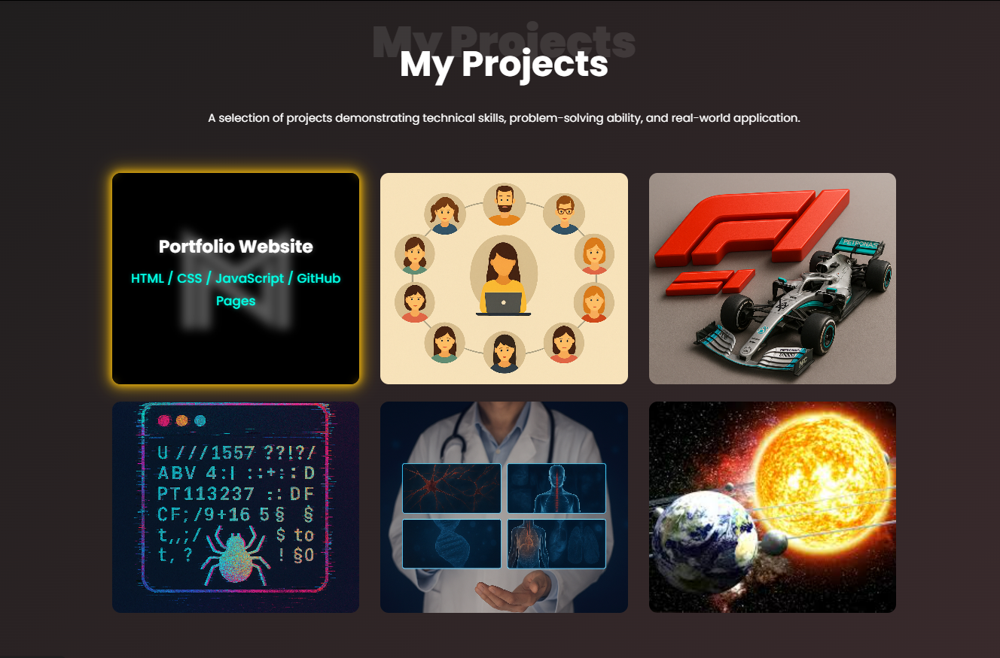
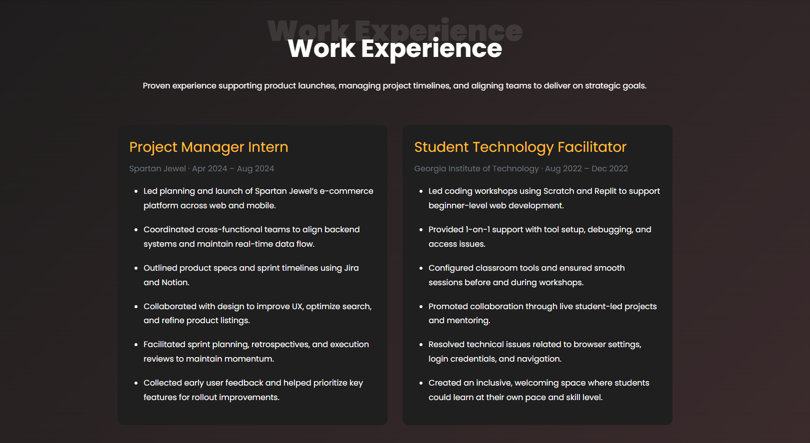
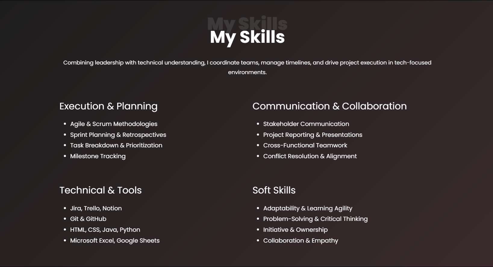

# 🌐 Muhammad Nadeem – Portfolio

This is my personal portfolio site, designed to highlight my work, mindset, and values as an aspiring **Project Manager** and **Tech Strategist** with a foundation in software development, cross-functional collaboration, and tech-focused execution.

🔗 **Live Portfolio**: [harris1250.github.io/muhammad-portfolio](https://harris1250.github.io/muhammad-portfolio)  
🔗 **LinkedIn**: [linkedin.com/in/muhammad-nadeem-977683251](https://www.linkedin.com/in/muhammad-nadeem-977683251/)

---

## 📚 Table of Contents

- [What This Project Does](#-what-this-project-does)
- [Tools & Tech Stack](#-tools--tech-stack)
- [Screenshots](#-screenshots)
- [How to Run This Project](#️-how-to-run-this-project)
- [Contact](#-contact)

---

## 👋 What This Project Does

This website is a clean, responsive, and professional portfolio highlighting:

- My most relevant technical and leadership projects  
- Recent work experience in tech and coordination  
- Skillset focused on product thinking, execution, and teamwork  
- Branding and clarity as a PM-minded candidate

---

## 🚀 Key Features

- Responsive, mobile-first layout
- Animated project cards with hover effects
- Custom testimonial and work experience sections
- Clear, dark-themed design for focus and clarity

---

## 🧠 Tools & Tech Stack

| Category       | Tools/Technologies         |
|----------------|-----------------------------|
| PM & Workflow  | Jira, Trello, Notion        |
| Dev Tools      | Git, GitHub, VS Code        |
| Frontend       | HTML, CSS, JavaScript       |
| Hosting        | GitHub Pages                |

---

## 📸 Screenshots

### 🔹 Homepage  

### 🔹 Projects Section  

### 🔹 Work Experience  

### 🔹 Skills Section  

---

## ⚙️ How to Run This Project

No build tools or server setup required — just open the HTML locally.

1. git clone https://github.com/Harris1250/muhammad-portfolio.git
cd muhammad-portfolio

2. Open `index.html` in your browser.

Everything runs client-side with HTML/CSS/JS only.

## 📬 Contact

Let’s connect:  
📧 Email: harris.nadm@gmail.com  
🔗 LinkedIn: https://www.linkedin.com/in/muhammad-nadeem-977683251/

---

💡 Designed with clarity. Built with intent. Maintained with purpose.
